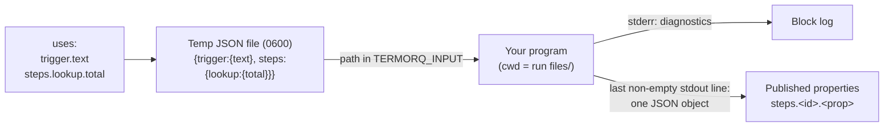

Every Code and Code file block in every language follows the same contract:

```mermaid
flowchart LR
  U["uses:<br/>trigger.text<br/>steps.lookup.total"] --> F["Temp JSON file (0600)<br/>{trigger:{text}, steps:{lookup:{total}}}"]
  F -->|"path in TERMORQ_INPUT"| P["Your program<br/>(cwd = run files/)"]
  P -->|"stderr: diagnostics"| L["Block log"]
  P -->|"last non-empty stdout line:<br/>one JSON object"| O["Published properties<br/>steps.&lt;id&gt;.&lt;prop&gt;"]
```

Once you understand this stage, you can write blocks in any of the seven supported languages.

{}
